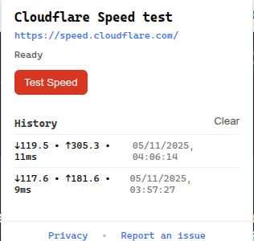
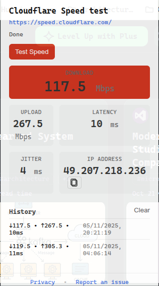

# Cloudflare Speedtest Extension

A Chrome extension that provides a compact toolbar popup for running Cloudflare-powered internet speed tests with one click.

> Please note that this isn't an official extension from Cloudflare.

 

## Features

- **One-Click Testing**: Simple toolbar popup for instant speed measurements
- **Cloudflare-Powered**: Uses [Cloudflare&#39;s official speedtest module](https://github.com/cloudflare/speedtest)
- **Comprehensive Metrics**: Download, upload, latency, and jitter measurements
- **Privacy-Focused**: All data stays local in your browser
- **History Tracking**: Stores your last two test results locally

## Metrics Captured

- **Download speed** (Mbps)
- **Upload speed** (Mbps)
- **Latency** (ms)
- **Jitter** (ms)

## Installation

### From Source

1. Download source code (zipped file) from the latest release from [Release](https://github.com/saradindusengupta/cloudflare-speedtest-extension/releases)
2. Extract it to a location of your choice
3. Load the extension in Chrome:

   - Open Chrome and go to `chrome://extensions/`
   - Enable "Developer mode" (top-right toggle)
   - Click "Load unpacked"
   - Select the directory where it was extracted. It should be  similar to `cloudflare-speedtest-extension-x.y.z` where the `x.y.z` would be the version number.

## Development

### Project structure

See [structure](docs/STRUCTURE.md) for a detailed description of the project's layout and the responsibilities of top-level folders and files.

```text
fastdotcom-extension/
├── manifest.json            # Extension configuration (MV3)
├── popup/
│   ├── popup.html           # Popup UI (loaded from browser action)
│   ├── popup.css            # Popup styles
│   └── popup.js             # Popup script (no test logic yet)
├── background/
│   └── service_worker.js    # Background service worker (install log, message stub)
├── content/
│   └── content.js           # Content script scaffold (not yet injected)
├── icons/
│   └── README.md            # Guidance for adding icons
├── docs/
│   ├── LOADING.md           # How to load the extension unpacked
│   └── STRUCTURE.md         # This file
├── README.md                # Project overview
└── LICENSE                  # License
```

### Build commands

- `npm run build` — Build the speedtest bundle for production
- `npm run watch` — Build in watch mode for development
- `npm run clean` — Remove built files

Local loading / development

If you want to load the extension into your browser for local development, see [Local Loading](docs/LOADING.md) for step-by-step instructions on loading the unpacked extension and running in development mode.

### Data storage

The extension stores only the last two completed test results in `chrome.storage.local`. No data is sent to external servers beyond what's required for the speed test itself (to Cloudflare's speed test servers).

### Architecture

This project uses:

- **Chrome Extension Manifest V3**
- **Service Worker** for background test orchestration
- **Cloudflare Speedtest Module** for accurate measurements
- **Rollup** for bundling the speedtest module

## Privacy

- All test results are stored locally in your browser
- No analytics or tracking
- Only communicates with Cloudflare's speed test servers (`https://speed.cloudflare.com/*`)
- [Privacy Policy](PRIVACY.md)

## License

This project is licensed under the terms of the `LICENSE` file in the repository root.

## Credits

Speed testing powered by [Cloudflare&#39;s speedtest module](https://github.com/cloudflare/speedtest).
